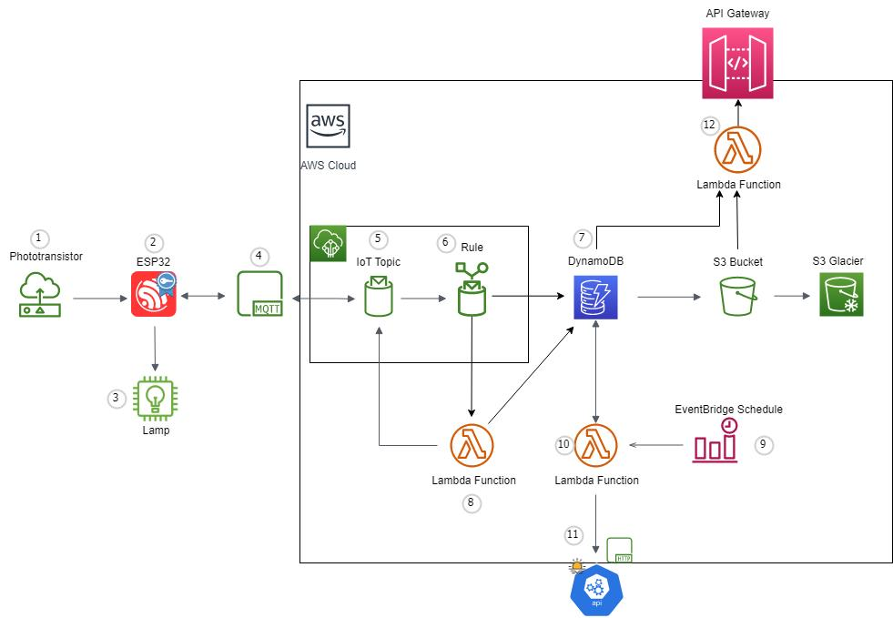

# The Cloud Controlled Automated Light Switch Project

## Project Overview
This project is to be considered a Proof of Concept of an automated lighting system. 
It is governed by the amount of light received by a photo transistor in relation
to the time of the day. Data is being sent over MQTTS to AWS IoT Core, where 
rules dictate whether or not it's appropriate to light a lamp. 

### Hardware
- The project uses an ESP32-C3-DevKitM-1 development board to gather, send and receive data over
  Wi-Fi to an MQTT topic in AWS IoT Core. An MCL053GD LED acts as a lamp.

# Architecture Overview

## Flowchart
Information flows as following:

1 - Light data is gathered with the photo transistor.

2 - The ESP32 (or the device) averages the light data gathered over 10 seconds and sends the data 
    to AWS IoT Core 
    over MQTTS. The ESP32 also receives data back from AWS upon which it acts. It can either turn
    lamp on or off.

3 - The lamp. It gets turned on and off by the ESP32.

4 - MQTT, a network procotol for Message Queuing. It's used to enable the ESP32 to communicate with 
    AWS Cloud Services. 

5 - Messages is being sent to an MQTT Topic in AWS's IoT Core, containing information about the           device's ID, light strength and the current lamp state (on or off). In this case our device sends (or
publishes) messages to the topic 'esp32/+/pub' where the + character is a wildcard for our 
devices' unique ID.  Since we're only operating one device in this PoC, the device ID has been
set to '1'. Our device also subscribes to the topic 'esp32/+/sub' which enables it to receive messages or commands which to act upon.

6 - Whenever a message has been published to 'esp32/+/pub' a message routing _rule_ is triggered.

7 - The data from the device (id, light value, on or off) is saved in a DynamoDB table, with a Time To Live currently set to 30 days. After 30 days the data is trasferred to an S3 Bucket to eventually be archived in an S3 Glacier.

8 - The message published to the MQTT topic also triggers another rule which invokes a Lambda Function.This function queries the DynamoDB table 'sunset-sunrise-times' to see whether the sun is up or not.   If the sun has set and the light value falls below a threshold value, the function publishes a message to 'esp32/+/sub' to relay a message back to the device, which turns on the lamp. Respectively, if the sun is __up__ and the light value surpasses the threshold value, we send a message to turn the lamp __off__.  LÄGG IN LÄNK TILL PARSE_LIGHT_DATA-KOD HÄR  Information regarding sunrise and sunset times is in turn handled by:

9 - An EventBridge Schedule has set to invoke a Lambda function once a day at 01:00.

10+11 - A Lambda function makes an API call to https://api.sunrise-sunset.org with the coordinates of the device to gather the times for the sunrise and sunset of the current day and saves it in the DynamoDB table being used in section 8.  LÄGG IN LÄNK TILL GET_SUN_INFO_KOD HÄR

12 - An API Gateway is setup to enable RESTful APIs for external information retrieval regarding collected light source data or the current state (on or off) of individual or collective lamps.
